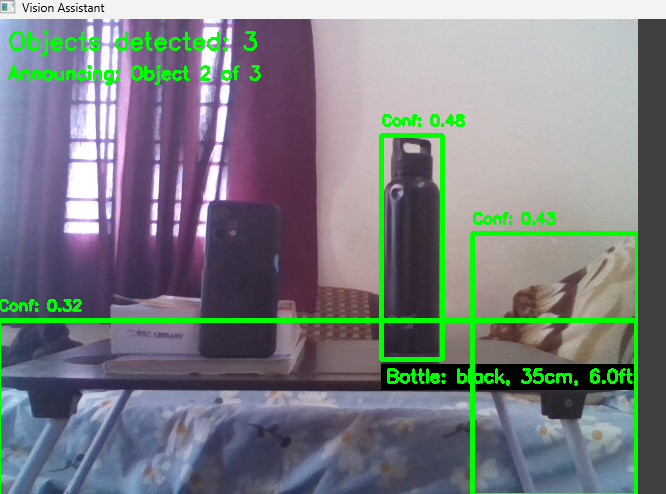

# Interactive-Virtual-Assistant-for-Visually-Impaired-using-YOLO11-and-OpenCv
YOLO11 detection, MiDaS depth estimation, color recognition, text-to-speech, voice control, GUI for visually impaired assistance
#YOLO11 detection, MiDaS depth estimation, color recognition, text-to-speech, voice control, GUI for visually impaired assistance

<h3>Project Overview</h3>
The Interactive Assistive System for Visually Impaired is designed to improve the independence and safety of visually impaired individuals by providing real-time environmental awareness through intelligent computer vision and audio feedback. The core functionality is built around: Real-time object detection using a custom-trained YOLOv8 model that can identify a variety of common objects such as people, furniture, and everyday items from live webcam video. Depth estimation leveraging the MiDaS model to approximate the distance between the user and detected objects, enabling spatial understanding of the environment. Color recognition to provide richer descriptions by identifying the dominant color of detected objects. Height approximation to give an idea of object size relative to the user. Text-to-speech (TTS) integration using pyttsx3 to provide continuous spoken feedback describing detected objects, their distance, size, and color, allowing hands-free interaction. Voice command support via speech_recognition to enable starting and stopping the detection using simple voice prompts, enhancing accessibility. Graphical User Interface (GUI) built with Tkinter that provides manual controls for starting/stopping detection, adjusting confidence thresholds, and viewing system status. The system continuously processes frames from a webcam, performs object detection and depth analysis, and outputs synthesized speech to alert users about objects in their vicinity. The voice control functionality makes the system easier to operate without requiring physical interaction, which is crucial for the target user group. This project combines advanced AI models and accessible software interfaces to create an assistive technology solution that empowers visually impaired users to better understand and navigate their surroundings, promoting safety, confidence, and autonomy.
<h3>Features</h3>
1.Real-time object detection using a custom-trained YOLOv8 model. 
2.Depth estimation for accurate distance measurement using MiDaS. 
3.Dominant color recognition of detected objects for enhanced descriptions. 
4.Approximate height calculation of objects in the scene. 
5.Text-to-speech feedback that speaks out object details (type, color, distance, height). 
6.Voice command support to start and stop detection hands-free. 
7.Intuitive graphical user interface (GUI) with buttons and confidence slider. 
8.Multithreaded design to ensure smooth detection, speech, and voice recognition concurrently. 
<h3>Installation</h3>
<h5>Clone the repository:</h5>
git clone https://github.com/yourusername/vision-assistant.git 
cd vision-assistant 
<h5>Install dependencies: </h5>
pip install -r requirements.txt 
<h5>Run the application:</h5>
python vision_assistant.py 
<h3> Dataset</h3>
Due to file size limitations, the dataset is not included in this repository.
[Download Dataset from Google Drive](https://drive.google.com/drive/folders/1PFZzM97H1YwqXNx_oVwR4AZBPHTgmqJj?usp=drive_link)
<h3>Sample Output</h3>

